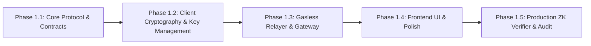
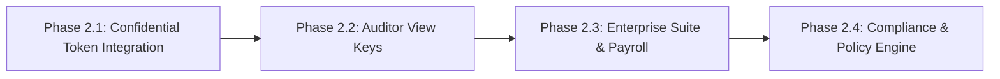

# Starlit Product Roadmap

Starlit is a privacy-first payment suite on the Stellar network. The roadmap is structured in two distinct phases:

1. **Phase 1 (Current Focus): Starlit Pay** — Consumer P2P payments with full anonymity using a Soroban Shielded Pool.
2. **Phase 2 (Future Expansion): Starlit Business** — Corporate and enterprise private payments using OpenZeppelin Confidential Tokens, Auditor View Keys, and compliance policy engines.

---

## 🚀 Phase 1: Starlit Pay (Current Focus)

**Goal:** Deliver a seamless, gasless, self-custodial, and fully anonymous peer-to-peer (P2P) payment application on Stellar Testnet and Mainnet.

### Milestone 1.1: Core Protocol & Contracts (In Progress)
- [x] Soroban Shielded Pool smart contract (`contracts/src/pool.rs`).
- [x] Fixed depth-20 Merkle tree (up to 1,048,576 commitments).
- [x] Double-spend prevention via on-chain nullifiers.
- [x] Unit test suite for `deposit`, `transfer`, and `withdraw` entry points.

### Milestone 1.2: Client Cryptography & Key Management (Completed)
- [x] Seed derivation from email + 6-digit PIN (`crypto.js`).
- [x] Spending key, ZK viewing key, and Stellar gas keypair generation.
- [x] Client-side note encryption via NaCl Box (`tweetnacl`).
- [x] One-way database identity commitment (`sha256(spendingKey)`).

### Milestone 1.3: Gasless Relayer & Gateway (Completed)
- [x] Express backend relayer to sponsor Stellar transaction gas fees.
- [x] Deposit gateway for converting public SEP-41 assets into shielded commitments.
- [x] Block indexer listening to contract events to maintain Supabase cache.

### Milestone 1.4: Frontend Experience & UI (Completed)
- [x] React/Vite web application with modern responsive layout.
- [x] Real-time decrypted balance display and shielded note management.
- [x] Universal pop-up action modals for Send, Receive, and Withdraw.
- [x] Smart receipts with live Stellar.expert explorer integration.
- [x] Desktop Activities navigation tab and transaction feed.

### Milestone 1.5: Private Asset Swaps (Active Focus)
- [ ] Private asset swap interface (`Swap.jsx`) for XLM ↔ USDC exchange.
- [ ] Real-time price calculation and slippage tolerance controls.
- [ ] Direct liquidity execution via Stellar DEX / Soroban AMM pools while preserving note privacy.

### Milestone 1.6: Production ZK Proofs & Mainnet Launch (Upcoming)
- [ ] Replace prototype ZK module (`zk.js`) with production Circom / Groth16 circuits.
- [ ] On-chain proof verification function inside Soroban pool contract.
- [ ] Smart contract security audit and stress testing on Stellar Mainnet.

---

## 💼 Phase 2: Starlit Business (Future Expansion)

**Goal:** Provide an enterprise-grade private payment platform for corporate payroll, B2B invoicing, and vendor payouts on Stellar.

### Milestone 2.1: Stellar Confidential Token Standard Integration
- Adapt Starlit architecture to interface with the **OpenZeppelin Confidential Token Contract Suite**.
- Encrypt corporate balances and payment amounts using **Pedersen commitments**.
- Integrate **UltraHonk / Barretenberg ZK verifiers** on Soroban for transaction validation without exposing balance sheets.

### Milestone 2.2: Compliance & Auditor View Keys
- Implement **Auditor View Keys** so businesses can grant read-only decryption access to internal compliance officers and tax auditors.
- Build a **Selective Disclosure Portal** enabling businesses to generate verifiable proof of single transactions for tax reporting.

### Milestone 2.3: Enterprise Feature Suite
- **Confidential Payroll:** Batch salary payouts where employee compensation amounts are hidden from public view and coworkers.
- **B2B Invoicing & Vendor Payouts:** Private settlement of supply chain contracts to protect sensitive commercial pricing.
- **Multi-Sig & Role-Based Access Control (RBAC):** Enterprise team permissioning for treasury approvals.

### Milestone 2.4: Identity Registries & Policy Engines
- Pluggable identity engines enforcing mandatory KYC/AML allowlists for business counterparties.
- Automated tax documentation export and regulatory compliance logging.

---

## 🎯 Summary Comparison

| Metric | Starlit Pay (Phase 1) | Starlit Business (Phase 2) |
| :--- | :--- | :--- |
| **Primary Audience** | Individual Consumers / P2P | Enterprises, Startups, B2B |
| **Privacy Scope** | **Full Anonymity** (Sender, Receiver, Amount hidden) | **Confidentiality** (Amount hidden, Identities verified) |
| **Underlying Cryptography** | Soroban Shielded Merkle Pool (Groth16) | OpenZeppelin Confidential Tokens (UltraHonk / Pedersen) |
| **Auditability** | Personal viewing keys | Institutional Auditor View Keys & Selective Disclosure |
| **Status** | **Active Development** | **Planned Future Horizon** |
