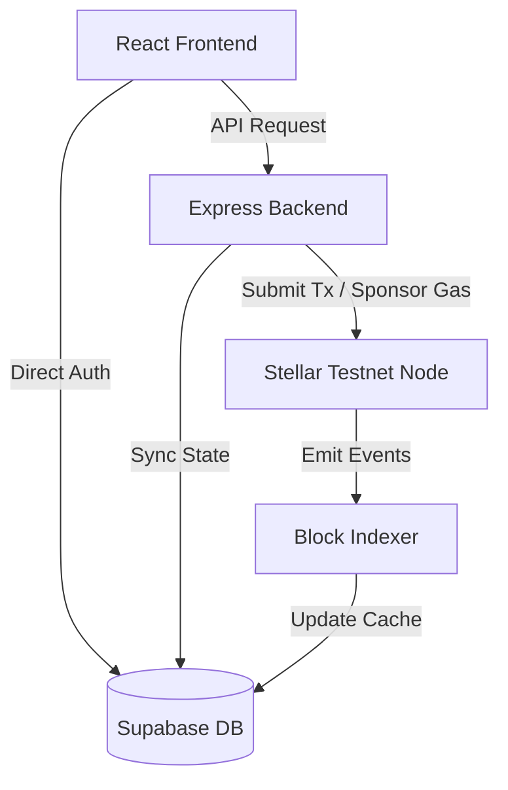

# Starlit Pay: Technical Reference Manual

Starlit Pay is a self-custodial, privacy-preserving payments application built on the Stellar Testnet. It utilizes a **Shielded Pool Smart Contract (Soroban)** and **Client-Side Cryptography** to hide transaction details, asset codes, and user balances from public blockchain explorers and database administrators.

---

## 🎯 Project Goal
To provide a fast, gasless (sponsored), and completely private payment experience on Stellar. 
*   **Privacy:** On-chain observers only see a collective pool vault. Database admins only see encrypted cyphertext (notes) and one-way hashes of identity keys.
*   **User Experience:** No complicated recovery phrases. Accounts are secured by Google OAuth and decrypted locally using a 6-digit PIN.

---

## 🏗️ Architecture Overview

The system consists of four primary layers:
1.  **Frontend (React/Vite):** Handles user interaction, local key derivation, note decryption, and transaction preparation.
2.  **Backend Router & Services (Node.js/Express):** Serves API endpoints, runs the block indexer, manages the deposit gateway, and acts as the transaction relayer.
3.  **Database (Supabase/PostgreSQL):** Stores user metadata, encrypted notes cache, and transaction logs.
4.  **Smart Contract (Soroban/Rust):** Enforces double-spend prevention, manages the Merkle tree of deposit commitments, and validates proofs.

---

## 🔑 Key Derivation & Encryption

To ensure absolute privacy, all sensitive cryptographic operations are done client-side in [crypto.js](file:///c:/Users/Playmaster/Desktop/Starlit/frontend/src/utils/crypto.js):

### 1. Key Derivation Flow
*   **Input:** User Email + 6-digit PIN.
*   **Master Seed:** `sha256(email.toLowerCase() + ":" + pin)`.
*   **Stellar Gas Keypair:** Derived from `sha256(masterSeed + ":stellar")`. Used for signing public transactions.
*   **ZK Spending Key:** Derived from `sha256(masterSeed + ":spending")`. Represented as a 64-character hex string.
*   **ZK Viewing Keypair:** Derived from `sha256(masterSeed + ":viewing")`. Used for encryption/decryption of notes via NaCl Box.

### 2. Database Identity Commitment
To verify login/PIN without storing the raw key:
*   The client hashes the derived spending key: `identity_commitment = sha256(spendingKey)`.
*   Only this SHA-256 hash is saved in `public.users.identity_commitment`. The backend/DB admin can never reverse this hash to recover the spending key or steal user funds.

---

## 💼 Shielded Notes & Database Privacy

Private balances are represented as **Shielded Notes**.
A note is a JSON payload: `{"amount": "100", "asset": "USDC", "secret": "hex...", "sender": "username"}`.

*   **Encryption:** Notes are encrypted client-side using the recipient's public viewing key.
*   **Database Cache (`shielded_notes` table):** Stores only the encrypted ciphertext. Column fields like `amount` and `token_address` are deleted to ensure the database admin cannot see user balances.
*   **Client Decryption:** The frontend fetches the encrypted ciphertexts from Supabase and decrypts them in-memory to calculate and display the user's balances.

---

## 🛠️ Soroban Smart Contract (`contracts/src/pool.rs`)

The contract maintains the ledger state of the private pool.

*   **Merkle Tree Configuration:** `TREE_DEPTH = 20`, supporting up to **1,048,576 leaf commitments**.
*   **Nullifiers:** A unique hash derived from a note that is published on-chain when a note is spent. Prevents double-spending.

### Core Entry Points
1.  `deposit(env, depositor, asset, amount, commitment)`: Transfer tokens from public depositor to the pool, and append the commitment to the Merkle tree.
2.  `withdraw(env, proof, nullifier, recipient, token, amount, root)`: Verify ZK proof, ensure nullifier is unspent, mark it spent, and release public tokens from the pool to the recipient.
3.  `transfer(env, proof, nullifiers, output_commitments, root)`: Verify ZK proof, verify root, mark input nullifiers as spent, and append new output commitments to the Merkle tree.
4.  `upgrade(env, new_wasm_hash)`: Upgrade contract bytecode in-place. Requires signature from the contract `Admin` account.

---

## 🔄 Core Workflows

### 1. Deposit Workflow
1.  **Client:** Derives public commitment from note. Calls backend `/api/gateway/deposit`.
2.  **Gateway:** Moves public tokens from user address to gateway, calls `deposit` on the contract, and stores the encrypted note in the `shielded_notes` table.
3.  **Indexer:** Emits event log, increments Merkle tree leaf index, and validates the updated root.

### 2. Transfer Workflow (Send & Receive)
1.  **Client:** Selects an unspent note. Derives nullifiers for input notes and commitments for output notes.
2.  **Client ZK Proof:** Generates a proof (simulated via `/utils/zk.js` in the prototype) verifying that the inputs belong to the Merkle tree and equal the outputs.
3.  **Client Submission:** Submits the proof, nullifiers, output commitments, and encrypted notes to `/api/relayer/transfer`.
4.  **Relayer:** Submits the transaction to the Soroban contract. The Relayer pays the gas fees (sponsored transaction).
5.  **Contract:** Verifies the ZK proof, checks that nullifiers are unspent, marks them spent, and inserts output commitments into the Merkle tree.
6.  **Indexer:** Detects the transaction, updates the local database note cache status to `spent` for input nullifiers, and inserts the new output notes.

---

## ⚙️ Project Configuration & Deployment

### Environment Variables (`backend/.env`)
*   `SHIELDED_POOL_CONTRACT_ID`: The active contract address deployed on Stellar Testnet.
*   `ADMIN_SECRET_KEY` / `ADMIN_PUBLIC_KEY`: The keypair with permission to upgrade the contract bytecode in the future.
*   `RELAYER_SECRET_KEY`: Funded Stellar account used by the Relayer to sponsor transaction gas fees.
*   `GATEWAY_SECRET_KEY`: Funded Stellar account used by the Deposit Gateway.

### Verification and Running
*   **Contract Tests:** Run `cargo test` in `contracts/` directory.
*   **Contract Build:** Run `stellar contract build` in `contracts/` directory.
*   **Backend Startup:** `npm start` inside `backend/`.
*   **Frontend Startup:** `npm run dev` inside `frontend/`.
